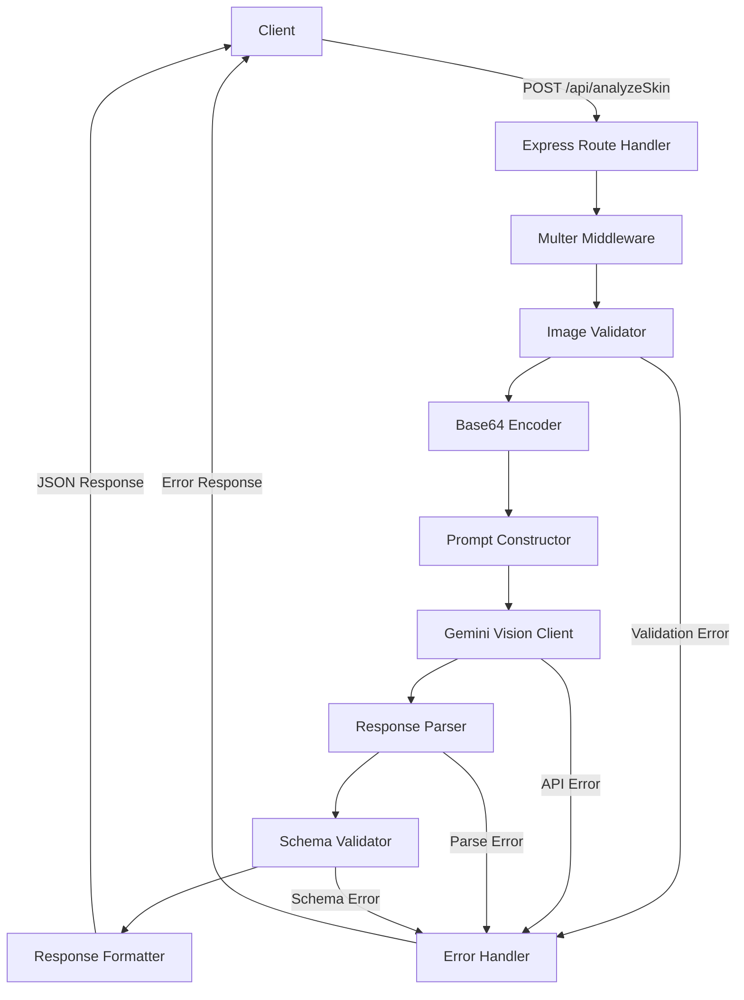

# Design Document: Skin Analysis Engine

## Overview

The Skin Analysis Engine is a RESTful API endpoint that processes facial photographs through Google Gemini Vision Pro to generate structured, clinical-grade skin assessments. This component serves as the entry point for LUMNICA AI's three-endpoint personalization flow (analyze → quiz → results).

The engine accepts multipart/form-data image uploads, validates format and size constraints, converts images to base64 encoding, constructs specialized dermatological prompts, invokes Gemini Vision Pro, parses responses with robust JSON extraction, validates against a defined schema, and returns structured skin assessment data.

Key design principles:
- Zero hardcoded analysis data (100% model-generated)
- Robust error handling with graceful degradation
- Schema-driven response validation
- Confidence scoring for quality assurance
- Clinical accuracy through specialized prompt engineering

## Architecture

### System Components



### Component Responsibilities

**Express Route Handler** (`routes/analyzeSkin.js`)
- Receives HTTP POST requests with multipart/form-data
- Orchestrates the analysis pipeline
- Manages error handling and response formatting
- Enforces rate limiting (inherited from server.js)

**Multer Middleware**
- Handles multipart/form-data parsing
- Stores uploaded files in memory buffer
- Enforces file size limits (10MB)
- Filters allowed MIME types (image/jpeg, image/png)

**Image Validator**
- Validates file existence in request
- Validates MIME type compliance
- Validates file size constraints
- Returns structured error messages for validation failures

**Base64 Encoder**
- Converts image buffer to base64 string
- Preserves MIME type metadata
- Prepares data for Gemini Vision API transmission

**Prompt Constructor** (`prompts/skinAnalysisPrompt.js`)
- Builds specialized dermatological analysis prompt
- Defines AI role as clinical-grade dermatologist
- Specifies output schema requirements
- Excludes biasing examples and predefined lists

**Gemini Vision Client** (`services/geminiService.js`)
- Interfaces with Google Gemini Vision Pro API
- Constructs vision request with image and prompt
- Handles API authentication and errors
- Returns raw text response

**Response Parser**
- Extracts JSON from markdown-wrapped responses
- Handles preamble text removal
- Validates JSON parseability
- Throws structured errors for unparseable responses

**Schema Validator**
- Validates response against expected structure
- Checks required fields presence
- Validates data types and formats
- Ensures concern array sorting (severity descending)

**Response Formatter**
- Wraps validated analysis in standard response envelope
- Adds confidence warnings for low scores
- Formats error responses consistently

## Components and Interfaces

### API Endpoint

**POST /api/analyzeSkin**

Request:
```
Content-Type: multipart/form-data

Field: image (file)
- Type: image/jpeg or image/png
- Max size: 10MB
```

Success Response (200):
```json
{
  "skinData": {
    "fitzpatrick": {
      "type": "III",
      "tone": "medium",
      "undertone": "warm",
      "hexRange": "#C68642"
    },
    "oiliness": {
      "overall": "combination",
      "tZone": "oily",
      "cheeks": "normal",
      "poreSize": "enlarged"
    },
    "texture": {
      "overall": "slightly uneven",
      "acne": "mild",
      "surfaceIrregularities": "visible"
    },
    "concerns": [
      { "name": "post-acne marks", "severity": "moderate" },
      { "name": "enlarged pores", "severity": "mild" }
    ],
    "skinAge": {
      "estimatedRange": "22–26",
      "agingSigns": false,
      "agingDetails": null
    },
    "confidence": {
      "score": 0.87,
      "notes": null
    }
  },
  "warning": "Low confidence — image may be blurry or poorly lit"
}
```

Error Responses:
```json
// 400 - Invalid image
{
  "error": "Invalid image",
  "details": "No image uploaded"
}

// 400 - Invalid format
{
  "error": "Invalid image",
  "details": "Invalid file type. Only JPEG, PNG allowed."
}

// 400 - File too large
{
  "error": "Invalid image",
  "details": "File too large"
}

// 422 - Unparseable response
{
  "error": "Analysis failed",
  "details": "AI response did not contain valid JSON",
  "rawResponse": "..."
}

// 500 - Internal error
{
  "error": "Skin analysis failed: [error message]"
}
```

### Module Interfaces

**geminiService.analyzeSkinFromImage(imageBase64, mimeType)**
```javascript
/**
 * Analyzes skin from base64-encoded image using Gemini Vision Pro
 * @param {string} imageBase64 - Base64-encoded image data
 * @param {string} mimeType - MIME type (image/jpeg or image/png)
 * @returns {Promise<Object>} Parsed skin analysis object
 * @throws {Error} If API call fails or response is unparseable
 */
```

**geminiService.extractJSON(text)**
```javascript
/**
 * Extracts first valid JSON object from text response
 * Handles markdown fences and preamble text
 * @param {string} text - Raw text response from Gemini
 * @returns {Object} Parsed JSON object
 * @throws {Error} If no valid JSON found or parse fails
 */
```

**skinAnalysisPrompt.getSkinAnalysisPrompt()**
```javascript
/**
 * Constructs the clinical dermatology analysis prompt
 * @returns {string} Formatted prompt for Gemini Vision
 */
```

**validator.validateAnalysisResponse(response)**
```javascript
/**
 * Validates analysis response against expected schema
 * @param {Object} response - Parsed response object
 * @returns {Object} { valid: boolean, error?: string }
 */
```

## Data Models

### SkinAnalysisResponse

```typescript
interface SkinAnalysisResponse {
  fitzpatrick: FitzpatrickData;
  oiliness: OilinessData;
  texture: TextureData;
  concerns: ConcernData[];
  skinAge: SkinAgeData;
  confidence: ConfidenceData;
}

interface FitzpatrickData {
  type: "I" | "II" | "III" | "IV" | "V" | "VI";
  tone: string; // e.g., "fair", "medium", "deep"
  undertone: "warm" | "cool" | "neutral" | "olive";
  hexRange: string; // e.g., "#C68642"
}

interface OilinessData {
  overall: "dry" | "normal" | "oily" | "combination";
  tZone: "dry" | "normal" | "oily";
  cheeks: "dry" | "normal" | "oily";
  poreSize: "small" | "medium" | "enlarged" | "very enlarged";
}

interface TextureData {
  overall: "smooth" | "slightly uneven" | "uneven" | "rough";
  acne: "none" | "mild" | "moderate" | "severe";
  surfaceIrregularities: string; // descriptive text
}

interface ConcernData {
  name: string;
  severity: "mild" | "moderate" | "severe";
}

interface SkinAgeData {
  estimatedRange: string; // e.g., "22–26"
  agingSigns: boolean;
  agingDetails: string | null;
}

interface ConfidenceData {
  score: number; // 0.0 to 1.0
  notes: string | null;
}
```

### Internal Data Flow

```mermaid
sequenceDiagram
    participant Client
    participant Route
    participant Multer
    participant Validator
    participant Encoder
    participant Prompt
    participant Gemini
    participant Parser
    participant Schema
    
    Client->>Route: POST /api/analyzeSkin
    Route->>Multer: Parse multipart
    Multer->>Validator: Validate image
    
    alt Validation fails
        Validator->>Route: Error
        Route->>Client: 400 Error
    end
    
    Validator->>Encoder: Convert to base64
    Encoder->>Prompt: Get analysis prompt
    Prompt->>Gemini: Call Vision API
    Gemini->>Parser: Raw text response
    
    alt Parse fails
        Parser->>Route: Error
        Route->>Client: 422 Error
    end
    
    Parser->>Schema: Validate structure
    
    alt Schema invalid
        Schema->>Route: Error
        Route->>Client: 422 Error
    end
    
    Schema->>Route: Valid response
    
    alt Low confidence
        Route->>Route: Add warning
    end
    
    Route->>Client: 200 Success
```




## Correctness Properties

*A property is a characteristic or behavior that should hold true across all valid executions of a system—essentially, a formal statement about what the system should do. Properties serve as the bridge between human-readable specifications and machine-verifiable correctness guarantees.*

### Property 1: MIME type acceptance

*For any* uploaded file with MIME type image/jpeg or image/png, the Image_Validator should accept the file (assuming size constraints are met).

**Validates: Requirements 1.2, 1.3**

### Property 2: File size rejection

*For any* uploaded file exceeding 10MB in size, the Image_Validator should reject the file with HTTP 400 error.

**Validates: Requirements 1.4**

### Property 3: Invalid MIME type rejection

*For any* uploaded file with MIME type other than image/jpeg or image/png, the Image_Validator should reject the file with HTTP 400 error containing "Invalid image" message.

**Validates: Requirements 1.6**

### Property 4: Base64 encoding round-trip

*For any* valid image buffer, encoding to base64 then decoding should preserve the original binary data.

**Validates: Requirements 2.1**

### Property 5: MIME type preservation

*For any* image with MIME type metadata, after base64 conversion, the MIME type should remain accessible and unchanged.

**Validates: Requirements 2.2**

### Property 6: Response schema completeness

*For any* valid analysis response, it should contain all required top-level objects: fitzpatrick (with type, tone, undertone, hexRange), oiliness (with overall, tZone, cheeks, poreSize), texture (with overall, acne, surfaceIrregularities), concerns array (with name and severity per item), skinAge (with estimatedRange, agingSigns, agingDetails), and confidence (with score and notes).

**Validates: Requirements 4.1, 4.2, 4.3, 4.4, 4.5, 4.6**

### Property 7: Concern array severity ordering

*For any* concerns array in the analysis response, the concerns should be ordered by severity in descending order (most severe first).

**Validates: Requirements 4.7**

### Property 8: Low confidence warning

*For any* analysis response with confidence score less than 0.5, the response should include a warning message "Low confidence — image may be blurry or poorly lit".

**Validates: Requirements 5.2**

### Property 9: Exception error response

*For any* exception that occurs during analysis processing, the system should return an HTTP error response (not crash) with an error message.

**Validates: Requirements 5.4**

### Property 10: Concern array integrity

*For any* analysis response, the concerns array in the final output should match the concerns array from the raw Gemini Vision response without modification (no filtering, no additions, no reordering beyond severity sort).

**Validates: Requirements 6.1, 6.2, 6.4**

### Property 11: Markdown fence extraction

*For any* text response containing JSON wrapped in markdown code fences (```json ... ``` or ``` ... ```), the parser should successfully extract the JSON content.

**Validates: Requirements 7.1**

### Property 12: Preamble text extraction

*For any* text response containing JSON with preamble text before it, the parser should successfully extract the JSON object.

**Validates: Requirements 7.2**

### Property 13: JSON parsing round-trip

*For any* extracted JSON string from a response, parsing it should produce a valid JavaScript object that can be validated against the schema.

**Validates: Requirements 7.4**

## Error Handling

### Error Categories

**Validation Errors (HTTP 400)**
- Missing image file in request
- Invalid MIME type (not image/jpeg or image/png)
- File size exceeds 10MB limit
- Malformed multipart/form-data request

Error response format:
```json
{
  "error": "Invalid image",
  "details": "[specific validation failure message]"
}
```

**Processing Errors (HTTP 422)**
- Gemini Vision returns unparseable JSON
- Response fails schema validation
- JSON extraction fails (no valid JSON found)

Error response format:
```json
{
  "error": "Analysis failed",
  "details": "[specific parsing/validation failure]",
  "rawResponse": "[truncated raw response for debugging]"
}
```

**Server Errors (HTTP 500)**
- Gemini API authentication failure
- Network timeout or connection error
- Unexpected exceptions during processing

Error response format:
```json
{
  "error": "Skin analysis failed: [error message]"
}
```

### Error Handling Strategy

**Graceful Degradation**
- All Gemini Vision API calls wrapped in try-catch blocks
- Errors logged with full context (stack trace, request details)
- Server continues running after failed requests
- No hardcoded fallback data (fail explicitly rather than return fake data)

**Error Logging**
```javascript
console.error('analyzeSkin error details:', {
  message: err.message,
  stack: err.stack,
  geminiKey: process.env.GEMINI_API_KEY ? 'SET' : 'NOT SET',
  imageSize: req.file?.size,
  mimeType: req.file?.mimetype
});
```

**Confidence-Based Warnings**
- Responses with confidence score < 0.5 include warning message
- Warning does not prevent response from being returned
- Client can decide whether to accept low-confidence results

**JSON Extraction Robustness**
- Multiple extraction strategies attempted in sequence:
  1. Remove markdown fences (```json and ```)
  2. Extract first complete JSON object using regex
  3. Attempt JSON.parse on extracted text
- If all strategies fail, return HTTP 422 with raw response

## Testing Strategy

### Dual Testing Approach

This feature requires both unit tests and property-based tests for comprehensive coverage:

**Unit Tests** - Focus on specific examples, edge cases, and integration points:
- Missing image file returns 400 error
- Invalid MIME type (e.g., image/gif) returns 400 error
- File exceeding 10MB returns 400 error
- Unparseable JSON returns 422 error with raw response
- Markdown-wrapped JSON is correctly extracted
- Preamble text is correctly removed
- Low confidence score includes warning message
- Error responses have correct format

**Property-Based Tests** - Verify universal properties across all inputs:
- Property 1: MIME type acceptance (Requirements 1.2, 1.3)
- Property 2: File size rejection (Requirements 1.4)
- Property 3: Invalid MIME type rejection (Requirements 1.6)
- Property 4: Base64 encoding round-trip (Requirements 2.1)
- Property 5: MIME type preservation (Requirements 2.2)
- Property 6: Response schema completeness (Requirements 4.1-4.6)
- Property 7: Concern array severity ordering (Requirements 4.7)
- Property 8: Low confidence warning (Requirements 5.2)
- Property 9: Exception error response (Requirements 5.4)
- Property 10: Concern array integrity (Requirements 6.1, 6.2, 6.4)
- Property 11: Markdown fence extraction (Requirements 7.1)
- Property 12: Preamble text extraction (Requirements 7.2)
- Property 13: JSON parsing round-trip (Requirements 7.4)

### Property-Based Testing Configuration

**Library Selection**: Use `fast-check` for JavaScript/Node.js property-based testing

**Test Configuration**:
- Minimum 100 iterations per property test
- Each test tagged with feature name and property reference
- Tag format: `// Feature: skin-analysis-engine, Property N: [property text]`

**Example Property Test Structure**:
```javascript
const fc = require('fast-check');

describe('Property 4: Base64 encoding round-trip', () => {
  it('should preserve image data through base64 encoding/decoding', () => {
    // Feature: skin-analysis-engine, Property 4: Base64 encoding round-trip
    fc.assert(
      fc.property(
        fc.uint8Array({ minLength: 100, maxLength: 1000 }), // random image data
        (imageBuffer) => {
          const base64 = Buffer.from(imageBuffer).toString('base64');
          const decoded = Buffer.from(base64, 'base64');
          return Buffer.compare(imageBuffer, decoded) === 0;
        }
      ),
      { numRuns: 100 }
    );
  });
});
```

### Integration Testing

**End-to-End Flow**:
1. Upload valid JPEG image → Receive structured analysis response
2. Upload valid PNG image → Receive structured analysis response
3. Upload oversized image → Receive 400 error
4. Upload invalid format → Receive 400 error
5. Mock Gemini API failure → Receive 500 error
6. Mock unparseable response → Receive 422 error

**Gemini API Mocking**:
- Use test fixtures for Gemini Vision responses
- Test various response formats (clean JSON, markdown-wrapped, with preamble)
- Test low confidence scenarios
- Test schema validation edge cases

### Test Coverage Goals

- Line coverage: >90%
- Branch coverage: >85%
- Critical paths: 100% (validation, parsing, error handling)
- Property tests: All 13 properties implemented
- Unit tests: All edge cases and examples covered

